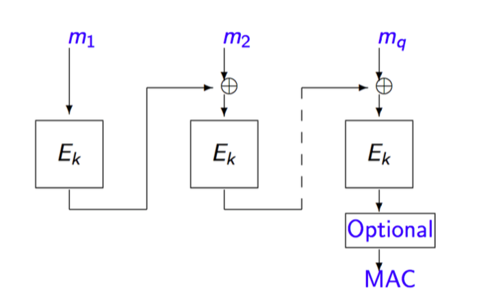
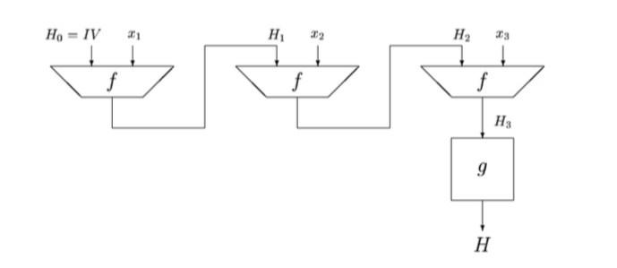

# Resumen de cripto 2018-2
La criptografía es multidisciplinaria( Electrotecnia, Computer Science, Matemática)

## Propiedades

  1. Confidencialidad (Algoritmo cifrado) : El intercambio de información debe ser conocida por **solo** los que **deben** conocerla, sin embargo un 3ro puede ver la metadata.

  2. Integridad (Hash) : Lo que se envie en el mensaje debe ser lo que se **entrega** a el receptor del mismo.

  3. Autenticidad (Firma) : Se debe saber quien fue el emisor del mensaje, comprobar quien me lo envió.

## Aspectos importantes para funcionalidades

 * Quienes son las partes envueltas? ¿Están en igualdad de condiciones?
 * Cuales son sus recursos?
 * Se conocian desde antes?
 * Porque, Como y que es lo que comunican?

## Principio de kerckhoffs

- Principio 0 :
  - El criptoanalista debe conocer en plenitud el algoritmo con el cual se realizará el encriptado.
  - El secretismo del mensaje debe residir en conocer la llave.
  - El número de llaves deben ser suficientemente largas para **evitar cualquier tipo de ataques de fuerza bruta**

## Principios de criptografía moderna

  - Principio 1 - Definición : Formulación de una definición rigurosa y precisa de seguridad, define 2 componentes, los cuales son la **sintaxis**(Algoritmo) y la **seguridad**(Medida de seguridad).

  - Principio 2 - Supuestos : Son las suposiciones no probadas, indicadas con precisión. Estas deben ser las minimas posibles.

  - Principio 3 - Reducción : Es la prueba de seguridad por la cual se acompaña a los principios 1 y 2.

### Definiciones clave
  - Data : Contenido
  - MetaData : Datos extras para enviar datos.
  - Riesgo : Probabilidad V/S riesgo.

## One Time Pad ( Cifrado de Vernam)

- Es totalmente seguro si se utiliza correctamente.

- El procedimiento se basa en que las 2 personas(receptor y emisor) tienen en su poder una llave unica, la cual  se puede obtener gracias a un libro entregado en persona y acordando una pagina del mismo. Basicamente es realizar un xor para cifrar y otro para descifrar de la siguiente manera :

  * Cifrar : **c = m xor k**
  * Descifrar : **m' = c xor k**

- Por lo tanto cada clave se tiene que usada una sola vez y el mensaje tiene que ser del mismo largo, esto se debe a que si se envian dos mensajes con la misma clave puedo realizar la siguiente operación  
**c = m xor c**

- Extramadamente rapido debido a que solo hacer un **XOR**

## Perfect Secrecy ( Secreto perfecto)

Basicamente significa que al obtener el mensaje cifrado **c** **NO** debe revelar ninguna información alguna sobre el mensaje original **m**, nisiquiera probabilistamente.

## Metodos de cifrado

### Sustitución
Más rondas no otorgan más seguridad, Existen 2 tipos  :

- **Monoalfabética** :

  Unidades del texto plano son sustituidas mediante un texto cifrado **k** que sigue un alfabeto , por ejemplo puede ser un desplazamiento a traves de un desplazamiento fijo.
  Ejemplos : CESAR, ROT13.

- **Polialfabética** :

  A diferencia de el monoalfabético, se utilizan distintos alfabetos y su aplicación dependerá de las circunstancias
  Ejemplos : Alberti, Virgenère(matriz).

### Permutación
Mas rondas tampoco otorgan más seguridad.

Ocupa un sistema que termina con un c que es una permutación de m, y las llaves **k** utilizadas son las permutaciones de cada posicion dentro de **m**
Ejemplos : Método chino, Escítala Lacedemonia.

## Cifrado por bloques

La mayoria de los algoritmos de cifrado modernos se utilizan mediante iteraciones alternando llaves y bloques.

### Modos de cifrado :

- **ECB(Electronic code book)** :
  El texto plano es divido en **t** bloques de largo **n** bits, si es necesario agregar padding al ultimo bloque se realiza. cada bloque se computa de la siguiente manera **ci = Ek(mi)**, por lo tanto es posible que para bloques con mi iguales su cifrado sea igual, provocando que se generen patrones en el texto final de cifrado.
  * Caracteristicas :
    - No existe propagación de errores
    - Bloques independientes
    - Susceptible a replay de bloques (medidas para arreglarlo son los checksums).
    - No existen patrones.

- **CBC(Cipher block chaining)** :
  A diferencia de ECB los bloques dependen del anterior, excepto el primer y ultimo bloque, al primer bloque se le agrega un vector de inicialización.
  * Caracteristicas :
    - Error de propagación.
    - Diferentes Vectores de inicializacion esconden patrones.
    - Necesita memoria interna para almacenar el estado anterior.

## Esquemas de Padding(ECB y CBC)

 El padding son formas de arreglar un elemento para que tenga el mismo largo que el otro, por su definición en inglés es **relleno**

 1. Agregar ceros.
 2. Agregando un 1 y despues ceros.
 3. Igual que el 2do método pero agregando un bloque extra con el largo de el bloque original.

## Hash
Es una función de mapeo que logra llevar una cadena de bits de una **longitud arbitraria** a una de **longitud fija** llamadas **valor hash**.
### Propiedades :
  1. **Resistencia a la primera pre-imagen** : Se refiere a cuando las pre-imagenes logran obtener una misma imagen.

  2. **Resistencia a la 2da pre-imagen** :  Se refiere a que al tener un **h(m)** y su **m'** uno al alterar ese **m'** no se llegue al mismo valor de **h(m)** al momento de hashearlo.

  3. **Resistencia a las colisiones** : Se refiere a que al tener un **m** y **m'** arbitrarios nunca deberán dar el mismo valor **h(m)**.

## Codigos de autenticación de mensajes(MAC)

 - El cifrado ofrece **Confidencialidad**, pero no necesariamente integridad.

 - El esquema **MAC** consiste en un **algoritmo MAC** y uno de **verificacion de MAC**
  * Algoritmo MAC : toma como entrada una llave **k** y un mensaje **m** y retorna una etiqueta.
  **t = MACk(m)**

  * Verificación de MAC : Toma como entrada un **t**, una llave **k** y un mensaje, devolviendo **true o false**

### Tipos de MAC
  * **Basado en cifrado de bloques**(CBC-MAC) :
    Es parecido al descrito en la sección de cifrado CBC pero no se utiliza un vector de inicializacion y además se le puede aplicar una función de manera opcional al ultimo bloque de cifrado

    * Padding :
      1. Método 1 : Agregar puros ceros.
      2. Método 2 : Agregar un "1" seguido de puros 0.
      3. Método 3 : Igual al **Método 1**, pero al final se le agrega el largo de la palabra original.

  * **Basado en funciones hash**(HMAC) :

    La construcción de una función hash se lleva a cabo mediante una iteración de una función de compresión **f**, estas iteraciones tienen como nombre **Merkle-Damgård**

  * **MAC customizadas** :

## Mac V/S Hash

- MAC : Ofrece tanto **integridad** como **autenticidad**

- Hash : Solamente ofrece **integridad**, por lo tanto tiene que ser enviado sobre un canal autenticado.

### Integridad con confidencialidad :

 - **MAC** : Se necesitan **2 llaves distintas** k1 y k2, una llave es para el cifrado y otra para MAC, por lo tanto se computa **c = Ek1(m)** y luego **MACk2(c)**

 - **HASH** : Solo se necesita **una llave** para el cifrado, se computa **h(m)** y se envía **c = Ek(m || h(m))**. Se podría pensar que no es seguro.

### Construyendo Mac desde Hash

1. Método de **Prefijo secreto** : **MACk(m) = h(k || m)**.
  * Es posible computar MAC(m || m') = h(k || m || m') sin conocer **k**.

2. Método de **Sufijo secreto** :
**MACk(m) = h(m || k)**.
  * Es posible realizar un **ataque fuera de línea** para encontrar colisiones en la función Hash

3. Método de **Envoltura con Padding** :
**MACk(m) = h(k || p || m || k)**
  * p es un string utilizado para la operación de padding sobre **k** para completar el  largo de un bloque.

### HMAC
  Por medio de utilización de
  **HMACk(m) = h( (k xor p1) || h((k xor p2)) || m )**

  Con p1, p2 como strings fijos utilizados para la operación de padding sobre k para completar el largo de un bloque completo.

### MAC en conjunto con cifrado

Construcción de bloques :

  * **Esquema de cifrado**  : ke, Encke(m), Decke(c)

  * **Esquema MAC** : ka, MACka, Vka(m,t)

1. **MAC y a continuación cifrado**

| Cifrado | Descifrado |
|---------|--------------|
|Algoritmo Enc*ke II ka(m)| Algoritmo Dec*ke II ka(m)|
| t <- MACka(c) |  m <- Decke(c) |
| c <- Encke(m II t) | Parseamos m' como m II t|
| Retorna c | Si Vka(m, t) = True entonces retorna **m**, de lo contrario retorna |

2. **Cifrado y MAC**

| Cifrado | Descifrado |
|---------|--------------|
|Algoritmo Enc*ke II ka(m)| Algoritmo Dec*ke II ka(m)|
| c <- Encke(m) | Parseamos c como c' II t |
| t <- MACka(m) | m' <- Decke(c')|
| Retorna c II t | Si Vka(m, t) = True entonces retorna **m**, de lo contrario retorna |

3. **Cifrado y  a continuación MAC**

| Cifrado | Descifrado |
|---------|--------------|
|Algoritmo Enc*ke II ka(m)| Algoritmo Dec*ke II ka(m)|
| c <- Encke(m) | Parseamos c como c' II t |
| t <- MACka(c) | m' <- Decke(c')|
| Retorna c II t | Si Vka(c', t) = True entonces retorna **m**, de lo contrario retorna |

## Criptografía de clave asimétrica(pública).

Cada actor tiene un par de llaves, que consisten en :

  * Una llave pública, que se encuentra de forma abierta, y es usada para cifrar

  * Una llave privada, que se mantiene en secreto, y es usada para descifrar

Por lo tanto cualquiera que conosca a un actor tendrá una llave **publica para cifrar**, pero solo
el actor que recivirá el mensaje podrá descifrarlo debido a que solo él o ella tiene la **llave privada para descifrar**

El cifrado debe ser **biyectivo**, implicando que sea **sobreyectivo** y **inyectivo** a la vez.

### RSA(Lógica de generación de llaves) 
